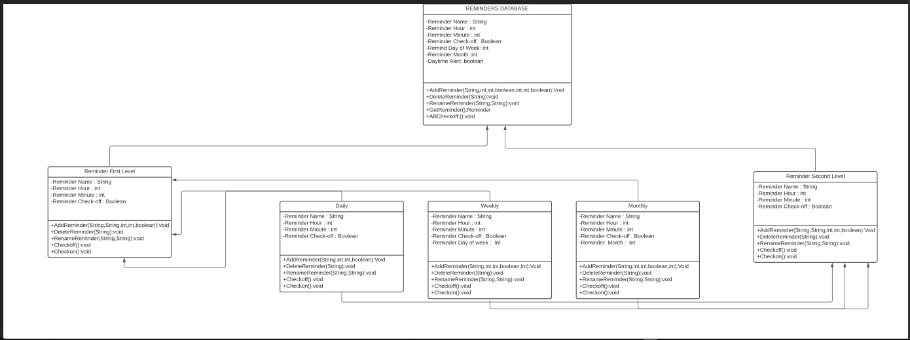
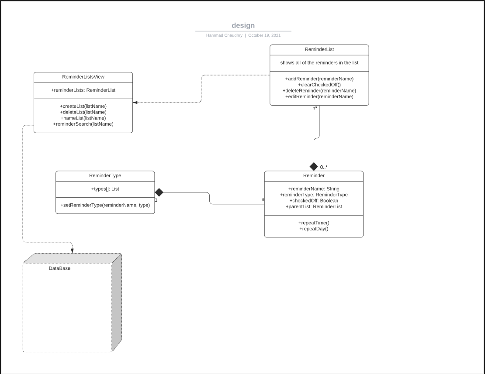
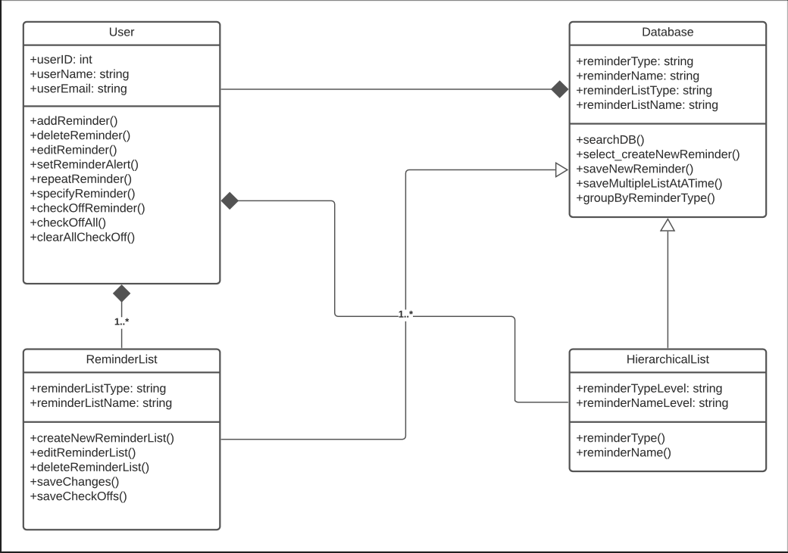
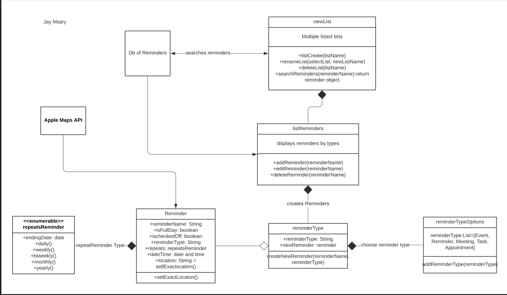
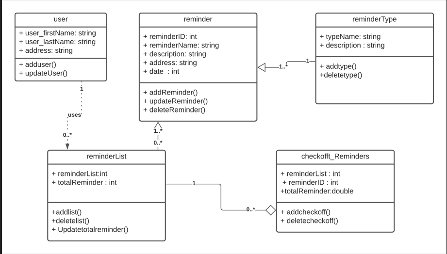
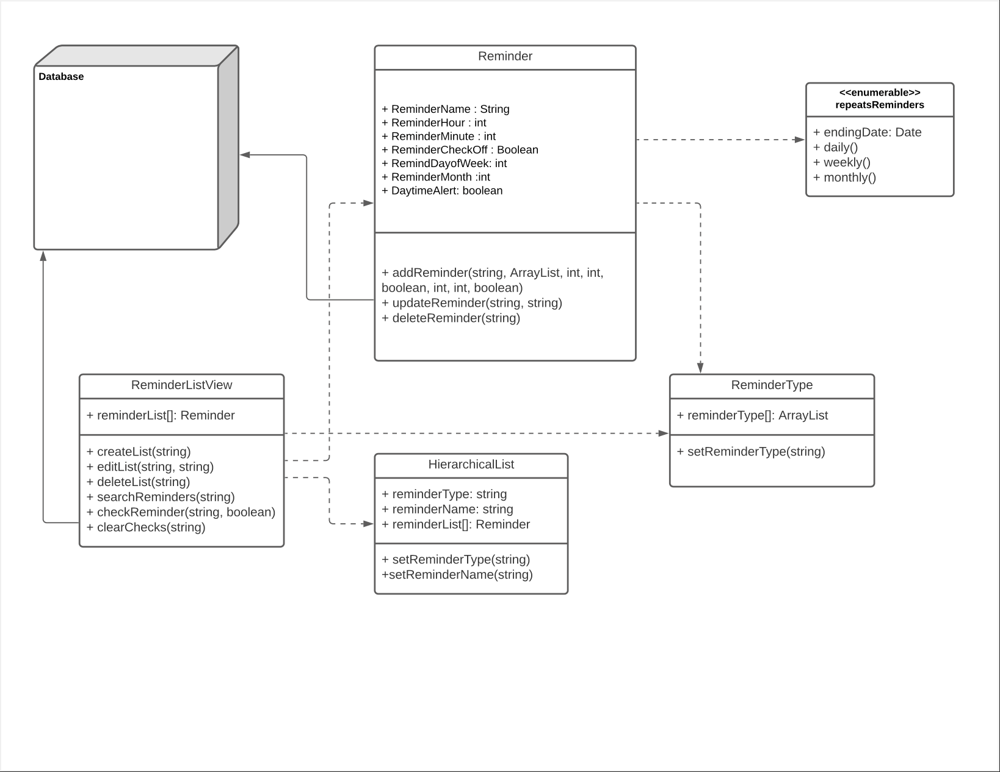

# Design Discussion

### Design 1 - Andy Qu (AndyQu2000)         

        

      
Pros:      
1. Includes all of the attributes and methods in Reminder class.     
2. Includes a hierarchy of two levels.       
3. Includes type which can be represented as days, week or month.      
Cons:     
1. Did not include DataBase.    
2. Could sort the different types of reminders in a single class.       

### Design 2 - Hammad Chaudhry (hchaudhry98)      

       

      
Pros:      
1. Implements basic design for reminders           
Cons:     
1. Does not display accurate relationships between classes    
2. Missing a few attributes and/or methods     

### Design 3 - Ivan Hossain (h2ivan)       

         

      
Pros:      
1. Database is being used efficiently      
2. Implementation of every attribute and operations             
Cons:     
1. Doesn't have location based reminder    
2. Data redundancy     

### Design 4 - Jay Mistry (jaymistry98)       

       

      
Pros:      
1. Repeats reminders based on specified date intervals.     
2. Good use of CRUD (Create, Read, Update, Delete)       
3. ListView class creates instances of other listReminders classes.      
Cons:     
1.  Heavily dependant on one Main class, if one class were to fail then the whole application would fail   
2.  There are too many connections.    

### Design 5 - Md Al Amin Khan (Khan2721)      

       

      
Pros:      
1. Good use for encapsulation database ( Create, Read, Delete, Update ).     
2. Integrated with the relational database system.               
Cons:     
1. Heavily depends with one class to another. If one fail it effects the whole application.    

### Team Design        

       

      
Commonalities between all individual designs     
1. Similar classes and attributes were found in all of our designs.     
2. Similar methods were also found throughout all of our designs     
3. All designs followed the basic structure to some degree     

Differences between Team design and Individual design:     
1. A more organized and more efficient design than the individual designs.     
2. Includes all classes and/or DBs that were missing from the individual designs.     
3. Excluded unnecessary APIs and/or classes.     
4. Decisions were made to include the more detailed attributes and classes from our individual designs.      

### Summary       

Whilst working on the project, we found that communicating on others' designs and critiquing them with an open mind led to a more efficient design. We also learnt a lot more about the UML class designs in regards to the relationships between the classes. As a team, we also came to decisions much faster on the attributes and methods to add for each of the classes because of our critiquing and our willingness to learn from one another. 
