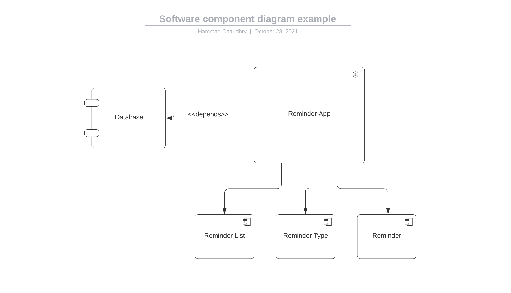
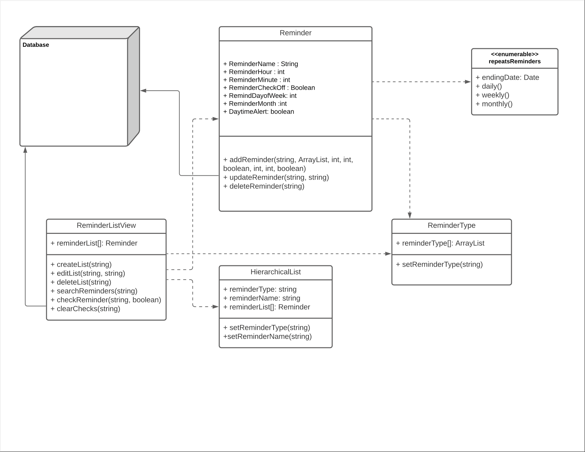

# Design Document

**Author**: TEAM 3

## 1 Design Considerations

### 1.1 Assumptions

The app will depend on the database for the storing of all reminders. The app will also depend on the User’s input to create reminders and/or edit and delete if need be.

### 1.2 Constraints

Adding a new reminder and making it visible as well as constrained to the other elements in the activity may prove to be a challenge. 

### 1.3 System Environment

The user must have an android device that can run android apps and must be API level 21 or above. 

## 2 Architectural Design

### 2.1 Component Diagram

### 2.2 Deployment Diagram

A deployment diagram is unnecessary. Everything that the reminder needs will be in the main application.

## 3 Low-Level Design

### 3.1 Class Diagram

     

### 3.2 Other Diagrams

 No extra diagrams were made nor needed.    

## 4 User Interface Design

