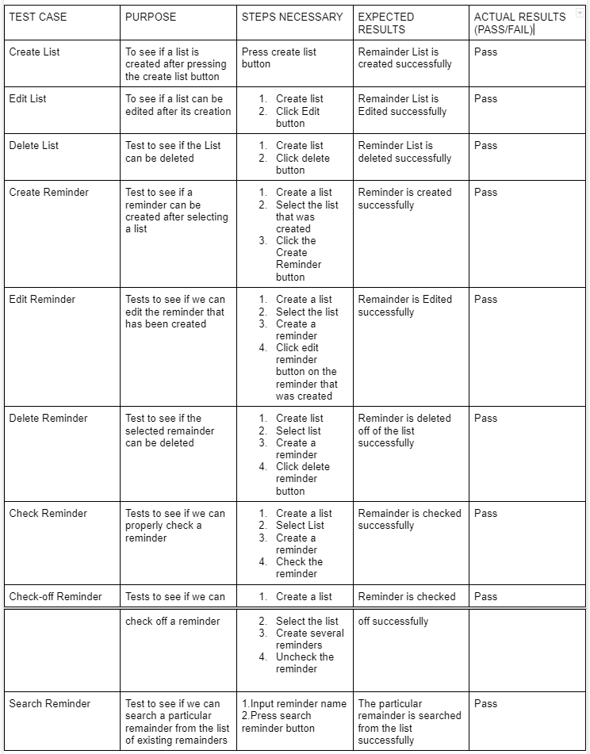

# Test Plan

**Author**: TEAM 3

## 1 Testing Strategy

### 1.1 Overall strategy

To test this app, we will most rely on unit testing, integration testing, and system testing to make sure our app is developed properly. We will start off with Unit testing near the beginning of development, and as things start to come together and more functionalities are added, we will then move on to integration testing to make sure that everything works in conjunction as we add more and more code. At the end, we will implement System Testing to make sure that the entire app functions as it should.

### 1.2 Test Selection

At the start, when there are a smaller number of functionalities added, we will implement unit testing. At a later stage we will implement integration testing as functionalities across several activities are added, and at the end of development, we will implement system testing to ensure the app’s functionality.

### 1.3 Adequacy Criterion

The main goal of our test cases will be to properly achieve the statement coverage.
This is our main purpose to make sure the application runs properly and given the different situations if it exists.

### 1.4 Bug Tracking

To implement bug tracking we can have a report bug button that will direct the user to a form. This form can be filled out and forwarded to a developer where we can inspect the bugs and fix it in the future update.

### 1.5 Technology

We will use a manual test case. In the future test cycle, we will implement JUnit and Espresso test

## 2 Test Cases

*This section should be the core of this document. You should provide a table of test cases, one per row. For each test case, the table should provide its purpose, the steps necessary to perform the test, the expected result, the actual result (to be filled later), pass/fail information (to be filled later), and any additional information you think is relevant.*  

