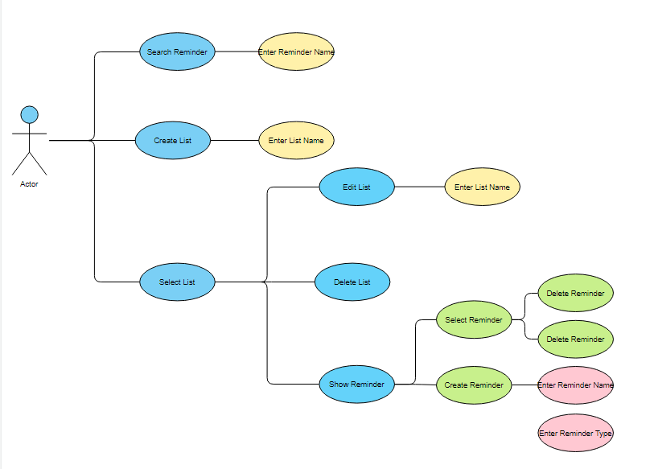

# Use Case Model

**Author**: TEAM 3

## 1 Use Case Diagram

## 2 Use Case Descriptions

##### Requirements
Users must be able to manage multiple lists of reminders. Multiple lists must be able to be created, selected, deleted or edited. Each of the reminders in the list must be organized by type and the user must be able to edit and/or delete each of these reminders. Reminders should also allow users to set the days to be repeated on or the date in the month for it to be repeated. There should also be an alert option as well when creating a list.        

##### Pre-Conditions
The user must have the Android App downloaded. An Android API Level of 21 or above is required.     

##### Post-Conditions
* The User has several lists containing different types of reminders.    
* The reminders are easily accessible to the User.    
* The User can control their own created remainders.   
* The Database has all of the reminders that the User created stored inside of it.     

##### Scenario
Yuseong wants to set a reminder for himself to go to the gym in the afternoon. Yuseong starts the android application and goes to his list of reminders and creates the reminder to go to the gym and sets the name of it as “Go to gym”, hour and minute. At the designated hour and minute, Yuseong will be reminded by the reminder application to go to the gym.
